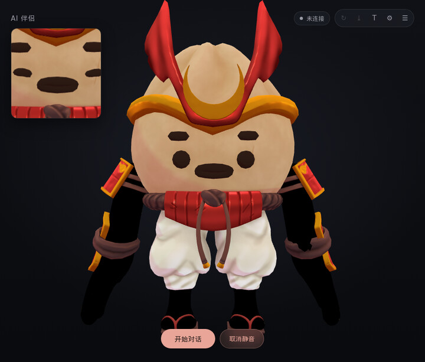

# mate

一个在自己电脑上跑的语音伴侣。对着麦克风说话，屏幕上的角色用你选的音色回应，嘴
型跟着声音动，你随时可以插话打断她。

语音识别、语音合成、口型生成全部在本机 GPU 上完成。只有大语言模型可以选：默认接
云端供应商，也可以换成本地的 Ollama，那样整套东西完全离线、不需要任何 API key。

```text
麦克风 → Silero VAD → Whisper large-v3-turbo → 大模型 → Qwen3-TTS → 扬声器
   ↑                                                            ↓
   └──────────── 随时插话打断 ────────────    浏览器渲染 + FlashHead 口型
```

## 预置 VRM 形象

mate 用 VRM 模型当角色的 3D 形象。安装时加 `--curated-avatars`（PowerShell 用
`-CuratedAvatars`）会拉一个 CC0 精选包：30 个 VRM，约 92 MB，全部 CC0、可商用、
不用署名。装好后在角色编辑器的 VRM 字段旁点「浏览…」，按缩略图点选即可，不用手填
路径，浏览器全程不碰公网。



图里是精选包中的 Bao Samurai。同一个包里还有女海盗 Rose、虎人 Cool Tiger 等 30
个，风格各异，都是 CC0。

## 需要什么

- **Windows 10/11**
- **NVIDIA 显卡**，显存 12 GB 起步（开发机是 RTX 4090 24 GB）。CUDA 12.8 需要
  525 以上的驱动
- **Python 3.11 和 3.10 各一个**，装的时候勾选「Install launcher for all
  users」。两个版本都要——三个服务的 torch 版本互相冲突，必须分开装
- **Rust**（[rustup.rs](https://rustup.rs/)），用来编译桌面外壳。不想装就用
  `-SkipBuild`，改用 PowerShell 脚本启动
- **Git**
- **磁盘约 30 GB**，建议放固态盘。机械盘上光是 `import torch` 就要 6 到 10 秒，
  启动会明显变慢

## 安装

```powershell
git clone https://github.com/phalanger/aimate.git
cd aimate
.\install.ps1
```

一条命令装完：建两个 Python 环境、拉模型权重、下 ffmpeg、编译 `mate.exe`。约
27 GB，随网速大概半小时到两小时。

**中途断了直接重跑**——每一步都会检查结果在不在，已经完成的自动跳过。

可选开关：

| 开关 | 多占 | 换来什么 |
| --- | --- | --- |
| `-WithMuseTalk` | 13.5 GB | 旧的口型后端。已被 FlashHead 取代，只为复现对比数据 |
| `-Mirror` | — | HuggingFace 走 hf-mirror.com |
| `-SkipBuild` | — | 不编译 `mate.exe`，不需要 Rust |

脚本**不管大模型**。任何 OpenAI 兼容的接口都能用，云端本地都行，而且是在面板里随
时切换的，所以这一项交给你自己选，见下一节。

装完：

```powershell
.\mate.exe
```

**第一次启动会再下约 1.7 GB**（Whisper 和 silero-vad，它们由运行时自动获取），
之后就不下了。启动完浏览器会自己打开面板；也可以手动开
<http://127.0.0.1:8900/>。

## 装完之后要做的两件事

**一、选一个大模型。** 默认没有配置任何供应商。两条路：

- **云端**：打开「设置 → 模型」，选一家填上 API key。DeepSeek、Kimi、智谱、硅基
  流动、xAI 都是 OpenAI 兼容接口，填好即时生效，不用重启。
- **本地**：装 [Ollama](https://ollama.com/download)，拉一个模型，然后在设置里选
  Ollama。这样整套东西完全离线。

```powershell
ollama pull qwen3:14b        # 14B，约 9 GB，24 GB 显存够用
ollama pull qwen3:8b         # 显存紧张就用这个
```

> **别选带 thinking 的模型。** 推理模型会先输出一整段思考再给答案，语音场景下这
> 意味着你要多等好几秒，而且它想得越多你等得越久。我们会在代理层把 `<think>` 块
> 剥掉、不让它被念出来（见下方"她把思考过程念出来了"），但**延迟省不掉**。
> Qwen3 默认开思考模式，用上面那个 `qwen3:14b` 时建议配一份
> `scripts/qwen3-14b.Modelfile` 关掉它。

**二、换个声音。** 所有角色初始都用 `assets/voices/default.wav`——那是安装脚本
从 `speech_to_speech` 包里拷出来的英文样例，**是男声**。打开「设置 → 音色库」，
上传或录一段十秒以内的干净人声，截取、点识别、保存，然后在角色里选它。

> 本仓库不附带任何参考音频。声音克隆用的片段是某个人的声音，有没有权利公开分发
> 它，不是这个项目能替你决定的事。

## 三个模型服务

它们是三个独立进程，因为三者的 torch 版本装不到一起：

| 服务 | 端口 | 环境 | 干什么 |
| --- | --- | --- | --- |
| 面板服务器 | 8900 | `s2s` | 界面、配置接口、大模型调用的代理 |
| 语音流水线 | 8765 | `s2s`（torch 2.9.1+cu128） | VAD、识别、合成，一个进程里 |
| 口型服务 | 8930 | `flashhead`（torch 2.7.1+cu128） | FlashHead 实时口型 |

`scripts/services.json` 是唯一的进程表，`supervisor.py` 按它启动、探活、重启。
`mate.exe` 只是它的外壳。

## 目录

```text
mate\
├── app\              桌面外壳（Rust + WebView2），编译出 mate.exe
├── web\              浏览器前端：渲染、音频、字幕、录制
├── server\           面板服务端：静态服务、配置 API、大模型代理
├── services\
│   ├── voice\        语音流水线的启动器（给上游打了三个补丁）
│   └── lipsync\      口型服务
├── scripts\          supervisor 与进程表
├── requirements\     三个环境各自的依赖清单
├── config\           角色、音色、供应商、设置        ← 你的数据，不进 git
├── assets\           模型、动作、视频、参考音频      ← 你的素材，不进 git
├── runtime\          解释器、模型权重、ffmpeg        ← 安装脚本下载
├── var\              日志、录像、缓存                ← 随时可删
└── docs\             设计与排错文档
```

`config/` 里跟踪的只有 `settings.json` 和三个 `*.example.json` 模板。你实际用的
`characters.json`、`voices.json`、`providers.json` 都被忽略——里面是你写的人设和
你的 API key，不该进版本库。

## 文档

| 文件 | 内容 |
| --- | --- |
| [docs/03-user-guide.md](docs/03-user-guide.md) | **遇到问题先看这个。** 使用说明和一张很长的排错表 |
| [docs/02-design.md](docs/02-design.md) | 架构、进程划分、目录约定 |
| [docs/01-analysis.md](docs/01-analysis.md) | 选型过程和硬件预算核算 |
| [docs/04-packaging.md](docs/04-packaging.md) | 桌面外壳、体积实测 |
| [docs/05-lipsync-spike.md](docs/05-lipsync-spike.md) | FlashHead 和 MuseTalk 的对比数据 |
| [docs/06-settings-ui.md](docs/06-settings-ui.md) | 设置项是怎么由数据驱动的 |
| [docs/07-voice-library.md](docs/07-voice-library.md) | 音色库，以及参考文本必须和音频对齐的原因 |
| [docs/08-wsl-deployment.md](docs/08-wsl-deployment.md) | WSL / Debian 部署记录 |

## 已知的几个坑

装的时候大概率不会碰到，但碰到了会很难查，所以写在这里。

### 她把思考过程念出来了

推理模型把思考写在 `<think>...</think>` 里，和正文一起返回。流水线拿到什么就念
什么，于是整段推演都会被读出来。

面板的大模型代理会**把这些块剥掉**（`server/llm_router.py` 的 `ThinkStripper`）。
它按流式分片工作，标签被切成 `<th` + `ink>` 也认得出来，遇到看不懂的响应一律原样
透传。所以正常情况下你不会听到思考内容——但**等待时间还在**，模型想多久你就等多
久。真正的解法还是别用推理模型。

如果你自己导入裸 GGUF：`ollama create` 一个只有 `FROM xxx.gguf` 的 Modelfile，模
板会是 `TEMPLATE {{ .Prompt }}`——纯文本透传，**角色和 system prompt 全部失效**，
模型开始自问自答编造整段对话，而且不报任何错。用 `ollama pull` 拉官方模型没有这
个问题，模板已经带好了。`ollama show <model> --template` 可以确认。

### Ollama 的工作目录决定它能不能用上显卡

从项目目录直接启动 `ollama serve` 会让它加载到冲突的 ggml 库，然后悄悄退回 CPU
——不报错，只是慢十倍。必须从它自己的安装目录启动，或者交给它的托盘图标。
`services.json` 里 Ollama 被标成 `managed: false` 就是这个原因：只探活，不接管。

### 端口 11434 可能被 Windows 占着

Windows 的保留端口范围有时会盖住 Ollama 的默认端口，表现是 `socket access
forbidden`。本项目把它挪到了 11700。查你自己的机器：

```powershell
netsh interface ipv4 show excludedportrange protocol=tcp
```

### ffmpeg 必须是 GPL 静态构建

保存视频时用 `libx264` 编码，LGPL 构建不含它，报错却完全不提 x264。共享构建则会
在换个环境后报 `0xC0000135`（找不到 DLL）。安装脚本下的是 GPL 静态版。验证：

```powershell
runtime\bin\ffmpeg.exe -hide_banner -encoders | Select-String libx264
```

### 系统代理会拦截本机调用

如果你设了 `HTTP_PROXY` 且 `NO_PROXY` 为空，流水线调本机的面板和 Ollama 会绕进
代理然后以各种奇怪的方式失败。项目里所有本机调用都显式排除了代理，但你自己加脚
本时要注意。

### 杀毒软件可能删掉启动脚本

隐藏窗口启动子进程的脚本会被某些国产杀软当成木马直接删除。如果 `scripts\` 下的
文件莫名消失，去看杀软的隔离区。

## 授权

本项目自身的代码采用 **MIT** 许可，见 [LICENSE](LICENSE)。

但它组合了不少第三方组件，各自的许可不同，**MIT 只覆盖这个仓库里的代码，不覆盖
安装脚本下载的任何东西**。其中三项需要特别注意：

- **Live2D Cubism Core** —— 专有软件，受
  [Live2D 专有软件许可协议](https://www.live2d.com/eula/live2d-proprietary-software-license-agreement_en.html)
  约束。本仓库**不包含**它，由 `install.ps1` 从 Live2D 官方获取。只有 2D 显示
  方式用得到；商用前请自行确认条款。
- **ffmpeg** —— 安装脚本下载的是 GPL 构建，因为需要 libx264。
- **模型权重** —— Qwen3-TTS、SoulX-FlashHead、Whisper、Qwen3 各有各的许可，请
  到各自的模型页确认，尤其是商用场景。

角色人设、参考音频是你自己的东西，也由你对它们的来源负责。VRM 模型方面，mate 自
带一个可选的 CC0 精选包（见开头，`--curated-avatars` 开启）；其它的 VRM、Live2D
模型仍由你自己准备。

### 关于声音克隆

**请在获得授权的前提下克隆声音。** 不要未经同意克隆真人的声音，尤其是公众人物
——这在很多地区已经涉及法律风险。用自己的录音，或者明确允许此用途的公开数据集。

这也是本仓库不附带任何参考音频的原因。

## 由来

本项目起于零度博客的一篇语音伴侣部署教程，但没有照搬它的步骤：核查后发现文章的
核心前提（"上游不支持 Qwen3-TTS 和 llama.cpp，需要自己改造"）已经不成立，
`huggingface/speech-to-speech` 现在原生支持这两者，文章里要手工修改的那些文件路
径在当前版本中都已不存在。取舍过程见
[docs/01-analysis.md](docs/01-analysis.md)。原文是纯语音方案，本项目增加了数字人
形象和实时口型。
