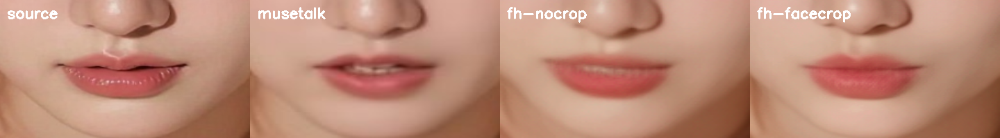

# 口型方案验证：SoulX-FlashHead vs MuseTalk

起因是两个抱怨：生成的口型视频**嘴唇颜色丢了**，后来换了素材颜色回来了，但
**嘴唇的纹路全糊了**。这篇记录换方案的验证过程和实测结论。

验证方式和麦克风那次一样：先做一个能一票否决的小实验，别急着集成。

## 一、结论

**建议换成 SoulX-FlashHead Lite。**四项实测全面优于 MuseTalk，而且集成面很小。

| | MuseTalk v1.5（现在） | SoulX-FlashHead Lite |
| --- | --- | --- |
| 稳态速度 | 25.3 FPS | **92.8 ~ 94.7 FPS** |
| 实时系数 | **0.99（几乎没余量）** | **0.27**（短样本）/ **0.43**（五分钟，见第九节） |
| 显存峰值 | 6.90 GB | **4.96 GB** |
| 人脸像素 | 212 px | **262 px** |
| 嘴唇颜色 | 比原图淡（a −3.1） | 与原图一致（a +1.8） |
| 嘴唇纹路 | 糊成一片 | 保留 |
| 许可证 | MIT（非商用限制见其仓库） | Apache-2.0 |

最要紧的一条：**MuseTalk 现在是擦着实时线在跑**，0.947 秒生成 0.96 秒的画面，
只剩 1% 余量。任何抖动都会掉帧。FlashHead 有 2.3 倍余量——按五分钟连续实测的 0.43
算，30 秒样本测出来的 0.27 偏乐观。

## 二、为什么它能解决"嘴唇糊"

这不是分辨率问题，是**原理**问题。

- **MuseTalk**：把下半张脸遮掉（`half_mask=True`），再从**不含嘴部**的上下文里
  把嘴补画回去。模型没见过原来的嘴，所以嘴唇的颜色和纹路只能猜——猜出来就是
  平滑的、没有唇纹的一片。口红越重，丢得越明显。
- **FlashHead**：拿**完整参考图**生成整张脸，嘴唇有据可依。

并排图（从左到右：原图、MuseTalk、FlashHead 不裁脸、FlashHead 裁脸）：



原图嘴唇有竖向唇纹和清晰唇线；MuseTalk 出来是蜡质的一片，唇线也软了；FlashHead
两种模式都保住了颗粒感和唇线，裁脸那版最好。

**一个要说清楚的地方**：Laplacian 算出来的 detail 分数三者差不多（占原图
23%~28%），跟肉眼看到的差距对不上。原因是那个指标在嘴部区域上取平均，而区域里
大部分是皮肤，唇纹被平均掉了。**这已经是第四次数字误导我了，最后还是靠并排图定
的案。**

## 三、一个必须纠正的想当然

一开始我以为"FlashHead 输出 512、MuseTalk 只有 256，所以更清楚"。**这个推理是错的。**

512 是**整幅画**，256 是 MuseTalk 的**人脸裁剪**。素材都是 1024×1024，脸只占约
37%，所以直接跑：

| 图 | 源图里的脸 | 到 512 帧里 | 对比 MuseTalk 256 |
| --- | --- | --- | --- |
| 00044 | 378 px | 189 px | 0.74× |
| 00042 / 00043 | 338 px | 169 px | 0.66× |

直接跑，脸的像素**反而更少**。必须开 `--use_face_crop`，先裁脸再生成，512 才真正
花在脸上——实测人脸 262 px，比 MuseTalk 的 212 px 多 24%。

所以**默认必须开 face crop**。`face_ratio` 默认 2.0（裁脸宽的 2 倍），可调到 1.5
让脸更大，代价是构图更紧。

## 四、实测数据

RTX 4090，素材 `download/z-image-turbo_00044_.png`，音频用现成的 TTS 输出。

### 速度与显存

```text
chunk  0: 254.447s   <- 一次性 kernel 编译
chunk  1:   0.255s for 24 frames (94.0 FPS)
chunk  2:   0.253s for 24 frames (94.8 FPS)
chunk  3:   0.262s for 24 frames (91.5 FPS)
chunk  4:   0.264s for 24 frames (90.8 FPS)
output 512x512, peak VRAM 4.91 GB, steady 92.8 FPS
```

模型每次生成 33 帧、丢掉 9 帧运动帧，**净出 24 帧 = 0.96 秒画面**，所以实时的门槛
是单块 < 0.96 秒，实测 0.25 秒。

### 长时间稳定性

30 秒、768 帧连续生成：

- **身份没有漂移**——第 0 帧和第 767 帧对比，人、发型、项链、衣服、背景全部一致
- **显存平的**，峰值始终 4.96 GB，没有泄漏
- 稳态 94.7 FPS，全程不掉

### 嘴部对比

| | 画面 | 人脸像素 | 唇色 a | 相对原图 |
| --- | --- | --- | --- | --- |
| 原图 | 1024×1024 | 378 | 155.4 | — |
| MuseTalk | 576×576 | 212 | 152.3 | **−3.1** |
| FlashHead 不裁脸 | 512×512 | 196 | 156.2 | +0.8 |
| FlashHead 裁脸 | 512×512 | **262** | 157.2 | **+1.8** |

## 五、为什么不是 LatentSync

LatentSync 1.6 方向是对的——专门用 512×512 重训来解决模糊。但：

- **约 10 倍于实时**（4090 上 10 秒视频要跑 100 秒）
- 推理要 **18 GB 显存**

一句 6 秒的回复要生成约 60 秒。对话不成立，而且加上 TTS 和 Whisper 装不下 24 GB。
只有"保存视频"这种离线场景才可能用，不值得。

FlashHead 快是因为它是**蒸馏过的少步模型**（`sample_steps=4`，Self-Forcing / DMD），
不是 20~50 步的扩散。

## 六、Windows 上的坑（都已解决）

官方只写了 Linux 的装法，实际在 Windows 上：

1. **`flash_attn` 不是必须的。**代码有 `compatibility_mode` 和 `else` 两条
   `F.scaled_dot_product_attention` 兜底路径，xfuser 自己也会打日志说
   "Flash Attention library not found, using pytorch attention"。Windows 没有官方
   flash-attn wheel，这本来是最大的坑，结果不用管。
2. **requirements.txt 要裁。**`nvidia-nccl-cu12` 是 Linux-only 装不上；
   `xformers`、`decord`、`flask`、`scikit-image` **全项目一处 import 都没有**；
   `gradio` 只有 demo 用。反过来 `einops` 被 import 了却没写进去，要补。
3. **`torch.compile` 需要 Triton。**装 `triton-windows==3.3.1.post21` 就能用。
   代价是首次运行编译 254 秒，之后有缓存（再跑首块 26 秒）。**打包时要预热这个
   缓存**，否则用户第一次开口要等四分钟。
4. **`--use_face_crop` 这个参数是坏的。**argparse 写的 `type=bool`，命令行传
   `False` 会被解析成 `True`（非空字符串）。只能改代码或用 API 传真正的 bool。
5. **Pro 的权重不用下。**lite 只用 LTX VAE，`VAE_Wan` 和 `Model_Pro` 加起来 6.5 GB
   可以跳过。
6. **`cv2.imread` 读不了中文路径。**OpenCV 自己做文件 IO，在 Windows 上走 ANSI
   代码页，所以 `assets/media/小满.png` 直接打不开，`imread` 返回 `None`，看起来
   像文件损坏。`np.fromfile` + `cv2.imdecode` 绕开文件名即可（写用
   `imencode` + `tofile`）。`VideoCapture` 不受影响——它把路径交给 FFmpeg，这也
   正是同一个角色待机视频能读、参考图读不了的原因。见 `flashhead_avatar.py`
   的 `_imread` / `_imwrite`。

## 七、下载

这台机器上下载极不稳定，实测（见 memory `download-proxy-asymmetry`）：

- **HuggingFace 走代理反而慢**：直连 8.3 MB/s，走代理 135 KB/s
- **PyTorch 相反**：直连 200 KB/s，代理 1.2 MB/s，SJTU 镜像 6 MB/s 最快
- **限速是按连接算的**：单连接 316 KB/s，四连接聚合 **18 MB/s**

所以大文件必须并行分块。用 `hf_transfer`（`HF_HUB_ENABLE_HF_TRANSFER=1` 配
`HF_ENDPOINT=https://hf-mirror.com`）6 GB 几分钟下完。

还有一个陷阱：**`huggingface-cli` 断线后会返回成功**，打印
"Returning existing local_dir as remote repo cannot be accessed"，退出码 0，留下
一个残缺文件。**不能信它的退出码，要自己核字节数。**

## 八、集成代价

比预想的小。口型服务本来就是独立进程（8930 端口），整个契约就一个方法：

```python
frames_for_audio(pcm, start_index) -> [jpeg bytes]
```

换后端 = 加一个实现了这个方法的类 + 一个独立解释器（`runtime\python\flashhead`，
torch 2.7.1）。**主流水线、面板、渲染器一行都不用动**——当初因为 torch 版本冲突
把口型拆成独立进程，现在正好让替换变便宜。

新环境体积：权重 7.7 GB（Model_Lite 5.8 + LTX VAE 1.6 + wav2vec2 0.36）。

## 九、风险清单，以及后来验掉的两条

选型当时诚实列了五条。2026-07-30 补测，其中两条最要紧的**已经证伪**，剩下三条是
设计取舍不是缺陷。

### 已验：长对话不漂（原"只测了 30 秒"）

同一段 37 秒语音循环八遍共五分钟，每遍取同一相位的一帧。**输入相同，所以差异只能
来自累积漂移**，这比比较不同内容灵敏得多。

| | 第 1 遍 | 第 3 遍 | 第 5 遍 | 第 8 遍 |
| --- | --- | --- | --- | --- |
| 人脸框 | 146×146 | 144×143 | 139×140 | 140×141 |
| 嘴部与第一遍差 | 0 | 6.0 | 9.9 | 8.3 |

脸型、肤色、发型、妆容全程稳定，肉眼看不出身份变化。人脸框缩 4% 是模型生成的头部
前倾，不是退化；嘴部差值**不随时间单调增长**（第 4 遍 10.3 比第 8 遍 8.3 还大），
是姿态噪声而非累积误差。

结论：这一代方法主打的"长时身份一致"（如 AsymTalker 的 600 秒）对本项目不解决任何
现有问题。

### 已验：中文口型分得开（原"没做逐音节核对"）

五个韵母各自单独合成、填进 1.5 秒固定时槽，所以每个韵母的帧号是算出来的，不靠强制
对齐去猜。取人脸框下部归一化到 128×96 后两两比较：

| | a | i | u | e | o |
| --- | --- | --- | --- | --- | --- |
| a | 0 | 10.0 | 11.1 | 11.6 | 11.1 |
| i | | 0 | 9.1 | 6.9 | 8.7 |
| u | | | 0 | 8.2 | 5.8 |
| e | | | | 0 | 4.9 |

非对角平均 **8.7**，而同一内容不同时刻的噪声只有 5.8~10.3。`a` 与其余四个的差都在
10 以上，分得最开；`e` 与 `o` 只差 4.9，本来就该像。嘴部特写肉眼可辨：`a` 张开露齿、
`i` 嘴角横拉、`u` 明显撅圆。

### 仍然成立的三条

- **它生成的是"整个人"，不是在真实视频上改嘴。**FlashHead 自己会生成头部小幅运动，
  但那是生成的，不是素材里那个人真实的动作。身体大幅动作没有了。
- **构图被锁定。**开 face crop 后画面就是一张脸。想要半身出镜得调 `face_zoom`
  或者做合成。
- **嘴部清晰度由素材取景决定，而且不报错。**参考图会被裁成和待机片段同样的构图，
  脸在画面里占多大直接决定模型分给嘴的像素。这是每份素材各自的属性，不是一次性
  设置——取景没选好，结果是"模糊"而不是失败。见下面「取景对齐」。

### 一条被数据修正的：实时系数没那么宽裕

| | 当初（30 秒样本） | 补测（5 分钟连续） |
| --- | --- | --- |
| 实时系数 | 0.27 | **0.43** |

五分钟视频用了 129 秒。仍然远在实时线内，但**余量比记录的少 60%**——真实余量是
2.3 倍不是 3.7 倍。短样本测出来的数字偏乐观，评估任何替代方案时要按 0.43 比。

### 补测踩的坑（记下来免得重犯）

量嘴部时调了个不存在的方法名 `get_face_box`，代码一路走"检测失败"的兜底框（画面
中间四分之一），量到的是下巴和脖子，第一版数字全部无效。用 `_face_box` 重做才对。
**兜底分支不报错是这类错误能活下来的原因**——它让错误的测量看起来像成功的测量。

## 十、已经切过去了：怎么接的

默认后端已改成 FlashHead（`scripts/services.json` 里 `--backend flashhead`）。
MuseTalk 没有删，把那一行改回 `--backend musetalk`、python 换成
`{python_musetalk}` 就切回去，两边的缓存互不覆盖（`info.json` 里有 `backend`
字段，restore 时会跳过不属于自己的）。

### 待机为什么还是用真人视频

实测生成的静音画面**基本是静止的**：6.7 秒里脸部中心只漂移 0.5 px，相邻帧像素
差 0.97/255。也就是说 FlashHead 自己的待机不眨眼、不呼吸、没有身体动作。

所以保持原来的分工：**待机放真人循环视频，说话时切生成画面**。反过来这也说明
切换是安全的——待机帧和说话首帧姿态几乎一致，硬切看不出来，不需要做淡入淡出。

`begin_turn()` 就是为这个加的：每次开口前把 pipeline 重新对准参考图，扔掉上一轮
的运动状态，保证每一轮都从同一个姿态起手。

### 取景对齐

这是接进去之后最费事的一件事，也是最容易被忽略的：**待机视频和生成画面在屏幕上
是同一个框**，脸的大小位置对不上，每次开口就会「跳」一下。

所以准备形象时会自动把参考图裁成和待机视频一样的构图（`_aligned_reference`）。
小玲这套素材实测：待机视频脸占 35.7%，参考图脸占 40.4%。

要完全对齐需要 1160 px 见方的裁剪，而参考图只有 1024——**差的那一圈没有办法凭空
补出来**。两种补法都试过，都比不补更糟：

| 补法 | 结果 |
| --- | --- |
| `BORDER_REPLICATE` | 边缘一行像素拉成条纹，而且模型会让条纹动起来 |
| `BORDER_REFLECT_101` | 把她自己的肩膀镜像折回画面，多出一条手臂 |

所以最后是**不补**：裁剪限制在图片范围内，剩下 13.3% 的取景误差如实记在
`info.json` 的 `framing_error_pct` 里。

#### 后来发现：这个"误差"其实该主动要一点

小满那套素材出来之后对比才看清楚。两张参考图都是 1024、都一样清楚，唯一的差别是
待机视频的取景：

| | 待机脸占比 | 模型拿到的脸 | 嘴部像素 | 取景误差 |
| --- | --- | --- | --- | --- |
| 小玲（拍得近） | 0.357 | 205 px | 205×93 | 13.3% |
| 小满（拍得宽） | 0.285 | 148 px | 147×67 | 0.9% |

**光是取景，嘴部像素差了将近一倍。**参考图会被裁成和待机片段一样的构图，所以待机
拍得宽，参考图就被一起拖下来——小满那张原图的脸有 294 px，最后只用到 148 px。

而小玲那 13.3% 的"误差"恰恰是她嘴更清楚的原因：她裁到 1024 就撞边了，参考脸比待机
脸大了 13%。**那个不对齐没人察觉，另一边那张糊掉的嘴一眼就看出来了。**

所以对齐目标从"完全一致"改成"故意大一点"，由 `DEFAULT_FACE_ZOOM` 控制（现在
1.2）。实测：

```text
xiaoman     zoom 1.0  crop 1024  face 147 px  error  +0.9%
            zoom 1.2  crop  861  face 175 px  error +20.0%
xiaolingfh  zoom 1.0  crop 1024  face 207 px  error +13.3%
            zoom 1.2  crop  967  face 219 px  error +20.0%
```

`zoom 1.0` 精确复现改动前两个缓存里的数字，所以这个改动只影响新的默认值。位置仍然
对齐，只有大小略大，看起来是轻微推近而不是跳切。

要更进一步只能从源头解决：待机视频拍得更近。代码这边已经没有余量了。

#### 再后来：代码这边其实还有余量，但要拿构图去换

上面那句"没有余量"说得太早。2026-07-30 把 `face_zoom` 完整扫了一遍才看清代价结构。
素材是小玲：参考图 1024×1024 脸 414 px，**待机视频 512×512** 脸 182 px。

| face_zoom | 裁剪边长 | 缩放 | 人脸像素 | 取景误差 | |
| --- | --- | --- | --- | --- | --- |
| 1.0 | 1024 | 0.500 | 207 | +13.3% | 撞到图片边界 |
| **1.2（在用）** | 967 | 0.529 | **219** | +20.0% | |
| 1.4 | 829 | 0.618 | 256 | +40.0% | |
| 1.6 | 725 | 0.706 | 292 | +60.0% | |
| **2.0** | 580 | **0.883** | **366** | +100.1% | **最后一档真实放大** |
| 2.4 | 483 | 1.060 | 439 | +140.2% | 开始插值 |
| 2.8 | 414 | 1.237 | 512 | +180.3% | 纯放大 |

**要看的是「缩放」那一列。** 小于 1 是下采样，1024 的原始细节被压进 512，每个人脸
像素都是真的；一旦越过 1.0 就是在插值，`face_px` 继续涨但涨的是假像素。分界线正好
落在 zoom 2.0 附近（裁剪 580 → 目标 512）。

**所以 1024 的参考图，真实可用的上限就是 zoom 2.0、人脸 366 px。** 换 2048 的图，
分界点推到 4.0 左右，天花板整整翻一倍——对做「贴回原图」方案的人来说，更大的源图
是硬需求而不是优化。

生成质量也测了，同一段音频、同一帧的嘴部特写：

| face_zoom | 实测人脸 | 嘴部原生尺寸 | 肉眼 |
| --- | --- | --- | --- |
| 1.2 | 226 px | 113×81 | 牙齿糊成一条白带，唇纹几乎没有 |
| 1.6 | 289 px | 144×104 | 牙齿分出颗粒，唇部竖纹开始可见 |
| 2.0 | 389 px | 195×133 | 牙齿逐颗分明，唇纹清晰，唇线锐利 |

**没有出现画质崩坏**——曾经担心"裁太紧会出模型的训练分布"，在 2.0 以内不成立。

**但最后仍然选 1.2。** 因为代价在另一边：zoom 1.6 的取景误差已经 +60%，2.0 是
+100%，画面变成齐肩特写，而待机视频是半身——嘴清楚了，代价是每次开口构图跳一大截。
在没有「生成头部再贴回真实画面」那套合成之前，1.2 是细节和构图之间的平衡点。

真要往上走，路线是明确的：**更大的参考图 + zoom 2.0 + 把生成的头合成回原始画面**。
那时嘴部面积是现在的 2.8 倍。合成那部分的难点不是接缝，是「贴到哪个身体上」——模型
自己会生成头部运动（五分钟里人脸框从 146 缩到 140），头在动而肩膀不动，脖子处会露
馅；贴到滚动播放的待机循环上则要逐帧跟踪并按姿态变形，很难做对。

顺带记一条量测教训：这一轮的清晰度数字（7 / 6 / 10）**又是没用的**——把嘴部裁剪
上采样到统一尺寸再算 Laplacian，插值把差异抹平了。结论还是靠并排图定的。这是同一
份文档里第五次出现"数字误导、图片定案"。

#### 改这个值要动两处

`DEFAULT_FACE_ZOOM` 是 `flashhead_avatar.py` 的模块常量，服务启动时读一次。改完
必须重新准备形象——`_cache_matches_source()` 会比对缓存里记的 `face_zoom`，不一致
就自动重建，所以不用手动删缓存，但**要真的去点一次**。

中间那段时间「代码写 1.2、实际跑 1.6」，界面上没有任何提示。`info.json` 里记了
`face_zoom` 才让它可查，但得主动去看。调完两边都确认一次。

### 没给参考图时，从待机视频里挑一帧

参考图是必填的，而**漏填不会报错，只会让「准备形象」这个按钮什么都不做**
（`_prepareMuseTalk` 开头 `if (!video || !avatarId) return;`）。配置里「糯米」就是
这个状态：有待机视频、没有参考图，点了没反应。所以这件事先是个 bug，其次才是个
功能。

服务端本来就在解码待机视频的首帧（`_first_frame_and_count`，用来做取景对齐），
拿它当参考图技术上只是少走一步。而且同源还白捡一个好处：参考图和循环视频的取景、
光线、姿态天然一致，切换时的跳变最小。

**但清晰度受视频限制，而且差得不少。** 决定嘴部细节的不是画面分辨率，是**脸在源图
里占多少像素**——送进模型的是脸周围裁出来缩到 512 的一块，脸小于 `512 / 1.2 ≈ 427`
px 就是在插值。用管线自己那个 mediapipe 检测器实测三个角色：

| 角色 | 待机视频抽帧 | 手工参考图 | 参考图优势 |
| --- | --- | --- | --- |
| 小满 | 512×512，脸 145 px | 1024×1024，脸 294 px | 2.0× |
| 小玲 | 512×512，脸 182 px | 1024×1024，脸 414 px | 2.3× |
| 糯米 | 720×1280，脸 **329 px** | 没有 | — |

所以定成**兜底，不是默认**：只在参考图为空时才抽帧，绝不覆盖已有的图。顺带说明
一件事——糯米抽出来的 329 px 比小满那张 1024 手工图的 294 px 还高，因为那段视频
是竖屏拍得近。**画面分辨率高不等于脸大**，两边都要看。

#### 挑哪一帧

首帧和尾帧基本没差别（小满 145/148，小玲 182/176，糯米 329/301），所以不做"首帧
还是尾帧"这种二选一，改成扫一遍挑。等间隔取样最多 48 帧，然后**依次筛掉**，不给
各项打分加权——权重是编出来的，筛选条件是能讲清楚的：

1. 必须**正好一张脸**。零张没法用；多张不知道该对谁。
2. 只留脸高在最大值 90% 以内的。静止镜头里这一步基本不淘汰谁，它挡的是人走近走远
   的镜头。
3. 再留正脸的一半。正脸程度用 mediapipe 的两只眼睛到鼻尖的距离差衡量，越对称越正。
4. 再留**闭嘴**的（见下）。
5. 剩下的挑**最清楚**的，拉普拉斯方差。

第五步要说明一下，因为同一个指标我在这份文档里已经误用过一次（见九节"补测踩的
坑"）：拉普拉斯方差**在放大过的图之间比是没有意义的**。这里比的是同一段视频、同一
分辨率、同一位置裁出来的帧，纯粹是"这一帧糊不糊"，成立。

#### 清晰度不能连嘴一起量，否则它专挑张嘴的那一帧

第一版没有第 4 步，清晰度也是在**整张脸**上算的。三个角色跑出来，**两个挑中了张嘴
的帧**，小满那张还吐着舌头。

原因不是巧合，是指标本身有偏：牙齿、舌头、上下唇的分界线全是高对比边缘，嘴一张，
脸框里的高频能量就上去了，拉普拉斯方差跟着涨。**所以"最清晰"实际上在挑"嘴张得最
大"。** 这类错误只有把图打开看才会发现，数字上它一切正常——和当年 `get_face_box`
悄悄回退到"画面中间那块"是同一种毛病。

两处都改了：

- 清晰度只在**脸框上部 55%** 上算（`SHARPNESS_UPPER_FACE`），眉毛和眼睛够判断糊
  不糊，且不含嘴。糊是整帧的事，少量一块不影响结论。
- 加了第 4 步，真的去量嘴张多大。人脸检测器只给六个关键点、嘴只有一个中心点，量不
  了；**face mesh 可以**，用内唇上下两点（13/14）的距离除以嘴角宽度（61/291），
  得到一个与尺度无关的开合度。0.08 以下算闭嘴，优先只留这些；整段都在说话、一个都
  没有时，退而取最闭的一半。

改完三个角色全部落在闭嘴帧上（开合度 0.03 / 0.01 / 0.013）。小满从第 88 帧换到第
154 帧，脸从 178 px 略降到 166 px——拿一点点尺寸换一张正常的嘴，值。

#### 仍然没测的一件事

闭嘴的参考图**是不是真的**比张嘴的生成得好，没测。上面这一步的理由是"参考图代表
这个人长什么样，吐舌头那张显然不是"，这是常识不是数据；真要证明得拿同一段音频、
两张参考图各生成一遍去比，那是 GPU 的活。所以它只是排序里的一档偏好，不是硬性
门槛，而且**挑出来的帧会存成文件、填回输入框**——你看得见它选了哪一帧，不满意可以
自己换。这也是这个功能不做成"每次准备时临时抽一帧"的原因。

### 音频切片

模型只按整片生成（24 帧 = 0.96 秒），而服务收到的是约 1 秒一块的 PCM，两边对不齐。
不足一片的尾巴留到下一块，不做补零——补零会在句子中间插进静音。回复结束时
`flush` 会调 `flush_tail()`，把最后那点补齐生成，再按实际音频长度裁掉多余的帧，
否则每句话最后零点几秒嘴是不动的。

实测端到端：4.0 秒音频出 100 帧（正好 4×25），稳态实时系数 0.35。

## 十一、建议

已按"两个后端并存、默认 FlashHead"接好，MuseTalk 随时可以切回去。

接下来值得做的：

1. **拿真实对话跑一段**。目前只测过一张图、两段音频、最长 30 秒。
2. **换一张取景更宽的参考图**，把那 13.3% 的取景误差消掉。
3. **打包时预热 torch.compile 缓存**，否则用户第一次开口要等四分钟。
